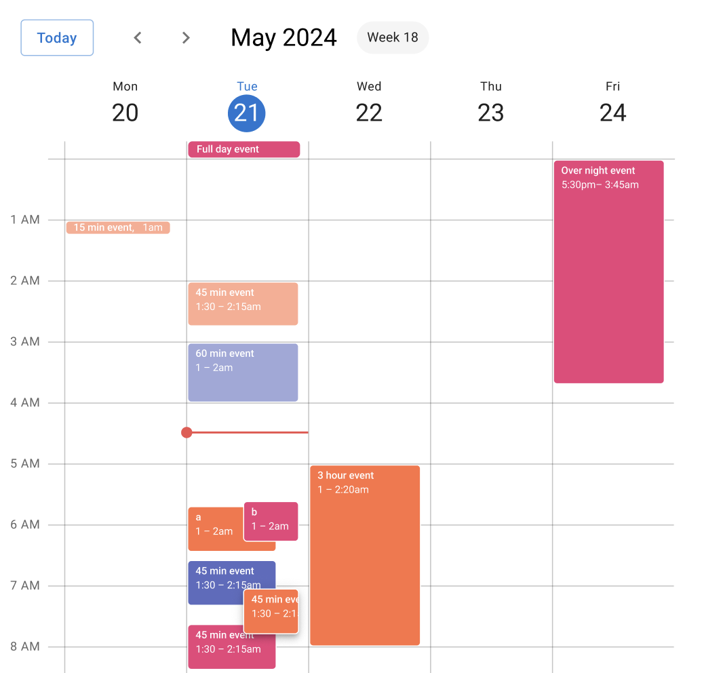
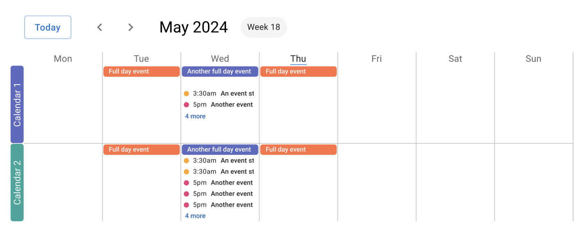
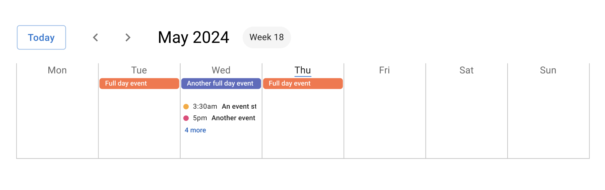
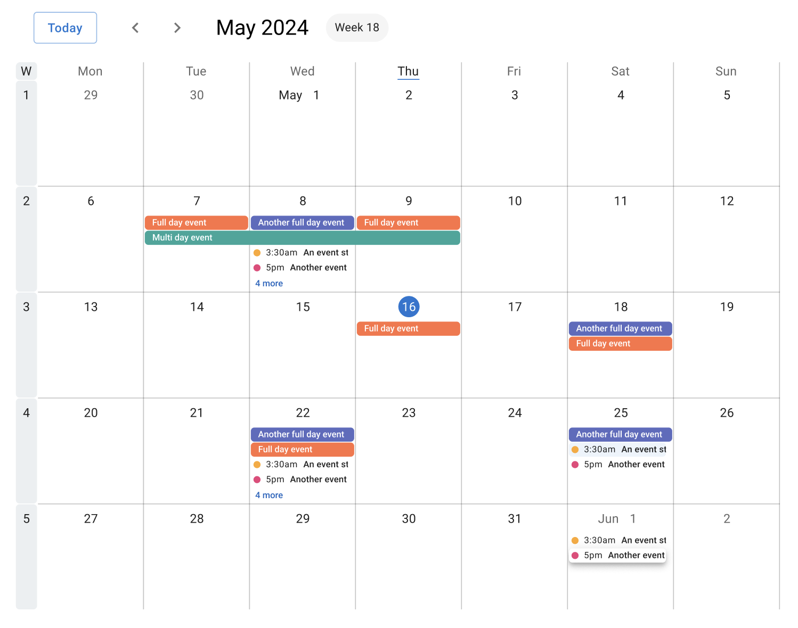
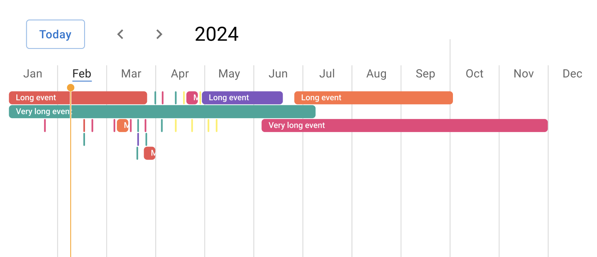
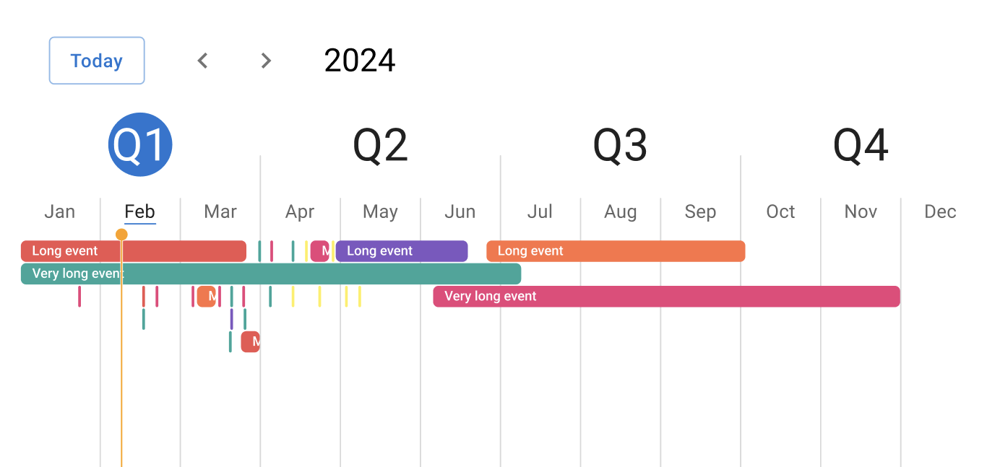
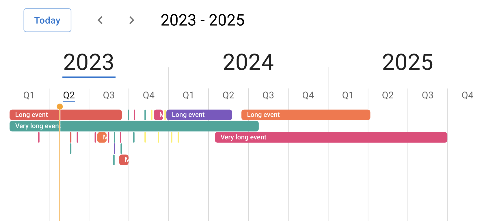

The Anocca calendar consists of UI low level components. It is up to you to build the calendar you want. The calendar is composed of the following components:

### Week calendar
Our bog standard week calendar.
```tsx
<WeekCalendar
  // calendar events - more on this later
  events={events}
  // start week on monday or sunday
  startDay='monday'
  // only applies when startDay is monday. Will render 5 days, mon-fri if true
  workWeek={false}
  // The current time. It is used to render the current time indicator
  now={new Date()}
  // Some date during the week. We use the date-fns `startOfWeek` to derive the first day of the week
  startOfWeek={new Date()}
/>
```


### Compact week calendar
The compact week calendar is a merge between the month calendar and the week calendar. It shows a week without the hours.
```tsx
<Box sx={{
  '.anocca-calendar__left-border': {
    display: 'none'
  },
  display: 'flex'
}}>
  <Label color="indigo">Calendar 1</Label>
  <CompactWeekCalendar
    // calendar events - more on this later
    events={events}
    // start week on monday or sunday
    startDay='monday'
    // only applies when startDay is monday. Will render 5 days, mon-fri if true
    workWeek={false}
    // The current time. It is used to render the current time indicator
    now={new Date()}
    // Some date during the week. We use the date-fns `startOfWeek` to derive the first day of the week
    startOfWeek={new Date()}
  />
</Box>
```

Example with labels



Example without a label



### Month calendar
Bog standard month calendar
```tsx
<MonthCalendar
  // calendar events - more on this later
  events={events}
  // The current time. It is used to render the current time indicator
  now={new Date()}
  // Some date during the month. We use the date-fns `startOfMonth` to derive the first day of the month
  startOfMonth={new Date()}
/>
```



### Gantt calendars

The gantt calendar, is not a real gantt chart but a year calendar with a gantt-like view

#### Month gantt

```tsx
<MonthGanttCalendar
  // Some date during the month that the calendar should start on 
  startOfMonth={new Date()}
  // Some date during the month that the calendar should end on
  endOfMonth={new Date()}

  // calendar events - more on this later
  events={events}
  // The current time. It is used to render the current time indicator
  now={new Date()}
/>
```



#### Quarter gantt

The gantt calendar, is not a real gantt chart but a year calendar with a gantt-like view
```tsx
<QuarterGanttCalendar
  // Some date during the quarter that the calendar should start on 
  startOfQuarter={new Date()}
  // Some date during the quarter that the calendar should end on
  endOfQuarter={new Date()}

  // calendar events - more on this later
  events={events}
  // The current time. It is used to render the current time indicator
  now={new Date()}
/>
```


#### Year gantt

The gantt calendar, is not a real gantt chart but a year calendar with a gantt-like view
```tsx
<YearGanttCalendar
  // Some date during the quarter that the calendar should start on 
  startOfYear={new Date()}
  // Some date during the quarter that the calendar should end on
  endOfYear={new Date()}

  // calendar events - more on this later
  events={events}
  // The current time. It is used to render the current time indicator
  now={new Date()}
/>
```



